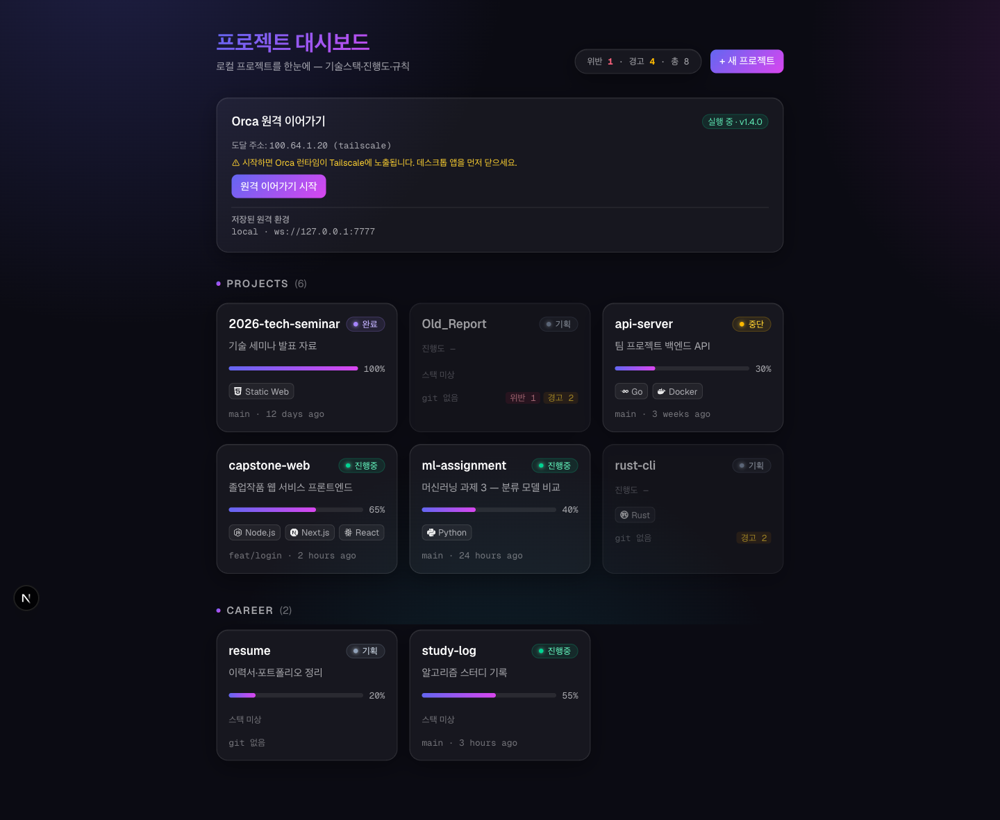
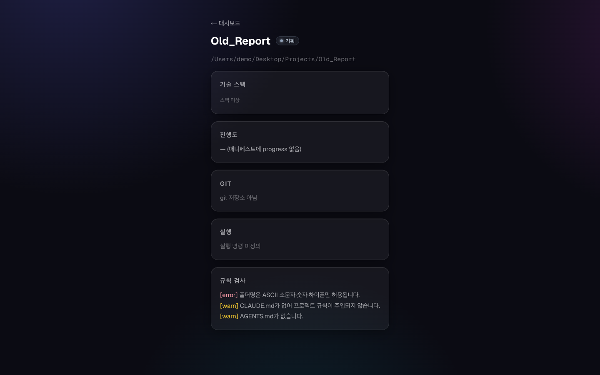
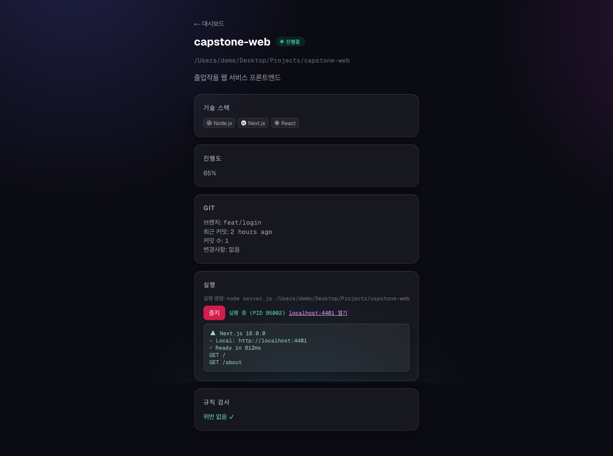
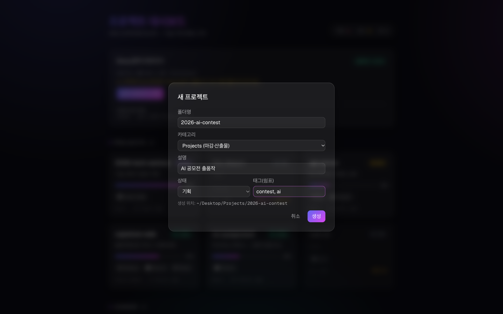
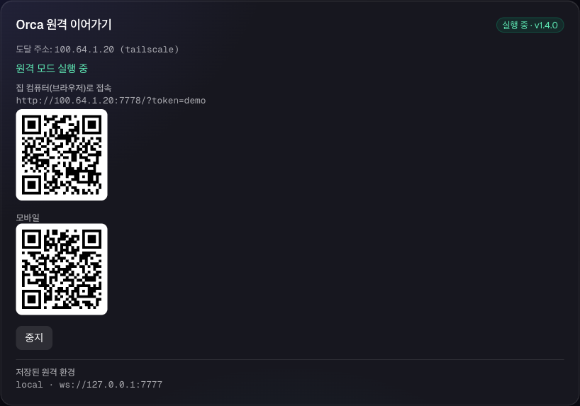
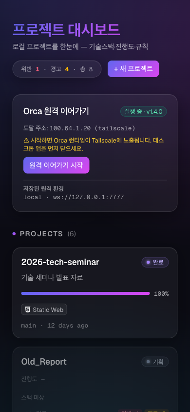
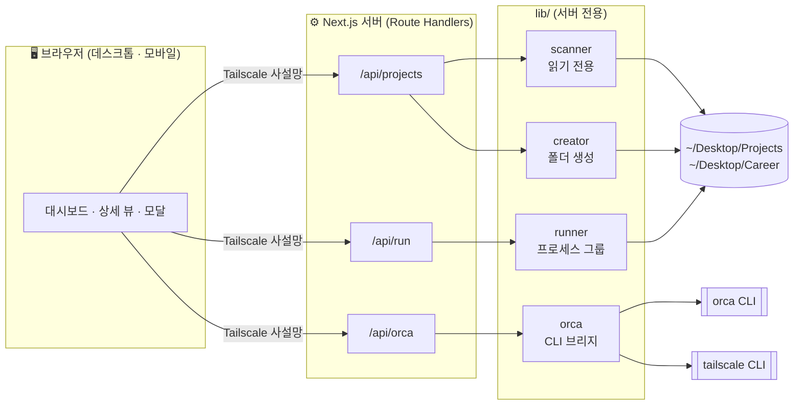

<div align="center">

# project-platform

**로컬 프로젝트의 현황과 규칙 준수 여부를 한 화면에서 관리하는 개인 개발 대시보드**

맥의 프로젝트 폴더를 스캔해 기술스택·진행도·git 상태를 보여 주고,
폴더마다 지켜야 할 작업 규칙을 사람 대신 검사합니다.


개인 프로젝트 · 1인 개발



</div>

> [!IMPORTANT]
> **로컬 전용 도구입니다.** 이 대시보드는 로컬 프로세스를 실행하는 API를 포함하므로, 인터넷에 노출하지 않고 루프백 또는 Tailscale 같은 사설망 주소에만 바인딩해 사용합니다.
> 스크린샷은 모두 데모 데이터로 촬영했습니다.

---

## 목차

- [기획 배경](#기획-배경)
- [화면 구성](#화면-구성)
- [주요 기능](#주요-기능)
- [안전 설계](#안전-설계)
- [설계 결정](#설계-결정)
- [아키텍처](#아키텍처)
- [기술 스택](#기술-스택)
- [실행 방법](#실행-방법)
- [테스트](#테스트)
- [API 개요](#api-개요)
- [프로젝트 구조](#프로젝트-구조)
- [개발 현황](#개발-현황)
- [개발 방식](#개발-방식)
- [문서](#문서)

---

## 기획 배경

과제·공모전·세미나·팀 프로젝트가 동시에 진행되면 프로젝트 폴더가 수십 개로 늘어납니다. 폴더 구조와 문서 규칙을 정해 두어도 사람이 매번 지키기는 어렵고 어떤 프로젝트가 어디까지 진행됐는지도 폴더를 하나씩 열어 봐야 알 수 있었습니다.

| 문제 | project-platform의 접근 |
|------|------------------------|
| 프로젝트 현황을 한눈에 볼 수 없음 | 프로젝트 루트를 **자동 스캔**해 카드 그리드로 표시 |
| 폴더·문서가 정해 둔 규칙을 위반하는 사례가 누적됨 | 규칙을 코드로 옮겨 **위반을 자동 검출**하고 카드에 배지로 표시 |
| 새 프로젝트를 만들 때마다 초기 구조를 수작업으로 구성 | 대시보드에서 **규칙을 준수하는 초기 구조 폴더를 생성** |
| 프로젝트를 확인하려면 터미널에서 직접 실행 | 상세 화면에서 **클릭 한 번으로 실행·중지·로그 확인** |
| 연구실 노트북 작업을 집에서 이어 가기 어려움 | Orca 세션을 **Tailscale 사설망으로 원격 연결** |

---

## 화면 구성

<table>
  <tr>
    <td align="center" width="50%">
      <br/>
      <sub><b>규칙 검사</b><br/>폴더명 형식 위반(error)과 필수 문서 누락(warn)</sub>
    </td>
    <td align="center" width="50%">
      <br/>
      <sub><b>프로젝트 실행</b><br/>실행 명령 표시 · PID · 포트 링크 · 로그 tail</sub>
    </td>
  </tr>
  <tr>
    <td align="center" width="50%">
      <br/>
      <sub><b>새 프로젝트</b><br/>폴더명 실시간 검증과 생성 위치 미리보기</sub>
    </td>
    <td align="center" width="50%">
      <br/>
      <sub><b>Orca 원격 이어가기</b><br/>Tailscale 주소 감지 · 접속 URL · 모바일 QR</sub>
    </td>
  </tr>
</table>

<p align="center">
  <br/>
  <sub><b>모바일</b> — 같은 tailnet의 휴대폰에서도 1열 레이아웃으로 확인</sub>
</p>

---

## 주요 기능

| 기능 | 설명 |
|------|------|
| **프로젝트 스캔** | `~/Desktop/Projects`(마감이 있는 프로젝트)와 `~/Desktop/Career`(진로·이력)의 하위 폴더를 각각 하나의 프로젝트로 인식합니다. 한 폴더의 오류가 전체 스캔을 중단시키지 않도록 `Promise.allSettled`로 격리합니다. |
| **기술스택 감지** | `package.json` 의존성, `requirements.txt`, `go.mod`, `Cargo.toml`, `Dockerfile` 등으로 Node.js · Next.js · React · Python · Go · Rust · Java · Docker 등 11종을 감지합니다. |
| **진행도 · git 상태** | 각 폴더의 `project.json`에서 상태와 진행도를 읽고 브랜치 · 최근 커밋 · 커밋 수 · 변경 여부를 함께 표시합니다. 매니페스트가 없으면 진행도를 임의로 만들지 않고 `—`로 표시합니다. |
| **규칙 감사** | 폴더명 형식, `CLAUDE.md` 존재와 첫 줄(`@AGENTS.md`), `AGENTS.md` 존재, `project.json` 스키마를 검사합니다. |
| **새 프로젝트 생성** | 폴더와 `CLAUDE.md` · `AGENTS.md` · `project.json`을 함께 만들어, 생성 직후부터 규칙 위반이 없는 상태로 시작합니다. |
| **프로젝트 실행** | `project.json`의 `run.cmd`를 프로세스 그룹으로 실행하고 중지 시 하위 프로세스까지 함께 종료합니다. 대시보드를 종료해도 실행 상태가 유지됩니다. |
| **Orca 원격 이어가기** | AI 에이전트 작업 도구 Orca의 원격 모드(`orca serve`)를 Tailscale 주소에 바인딩해 실행하고, 다른 컴퓨터용 URL과 모바일 QR을 표시합니다. |
| **부팅 자동 실행** | macOS LaunchAgent로 로그인 시 대시보드를 자동 기동하고 비정상 종료 시 재시작합니다. |

### 검사 규칙

| 규칙 ID | 심각도 | 내용 |
|---------|--------|------|
| `folder-name-format` | error | 폴더명은 ASCII 소문자 · 숫자 · 하이픈만 허용 |
| `claudemd-exists` | warn | 루트에 `CLAUDE.md`가 있어야 함 |
| `claudemd-first-line` | warn | `CLAUDE.md` 첫 줄이 `@AGENTS.md`여야 함 |
| `agentsmd-exists` | warn | 루트에 `AGENTS.md`가 있어야 함 |
| `manifest-invalid` | warn | `project.json`이 있으면 스키마를 통과해야 함 |

---

## 안전 설계

이 대시보드는 파일을 생성하고 로컬 명령을 실행하며 원격 접속을 허용합니다. 따라서 각 기능을 구현하기 전에 안전 조건을 먼저 정했습니다.

**명령 주입 차단**
- 실행 명령은 해당 프로젝트 `project.json`의 `run.cmd`에서만 가져옵니다. 웹 요청에는 폴더명과 동작(start/stop)만 담기며, 서버가 매니페스트를 다시 읽어 명령을 결정합니다.
- Orca 연동은 고정된 서브커맨드만 `execFile`/`spawn`의 인자 배열로 호출합니다. 클라이언트 입력은 명령 문자열에 들어가지 않습니다.

**경로 탐색 차단**
- 폴더명은 `/^[a-z0-9-]+$/`만 허용하므로 `/`, `..`, 공백, 비ASCII 문자가 들어갈 수 없습니다.
- 정규식 검사에 더해 `path.resolve` 결과의 상위 디렉터리가 허용된 루트인지 한 번 더 확인합니다.

**덮어쓰기 금지**
- 같은 이름의 폴더가 있으면 409로 거부합니다. `mkdir`의 `recursive: false`와 `EEXIST` 처리로 확인과 생성 사이의 경쟁 조건(TOCTOU)도 막습니다.

**네트워크 노출 최소화**
- 개발 중에 이 맥의 네트워크 인터페이스에 공인 IP가 NAT 없이 직접 할당되어 있다는 사실을 확인했습니다. 이 환경에서 기본 바인딩(`0.0.0.0`)을 사용하면 실행 API가 인터넷에 그대로 노출됩니다.
- 자동 실행 서버는 시작할 때마다 Tailscale IPv4(`100.64.0.0/10`)를 조회해 그 주소에만 바인딩합니다. 주소를 얻지 못하면 `0.0.0.0`으로 대체하지 않고 기동을 중단하며, launchd가 10초 간격으로 재시도합니다.
- `orca serve`도 감지된 사설 주소(Tailscale · LAN · 루프백)에만 바인딩하며, 공인 주소는 라우트와 매니저 두 단계에서 거부합니다.

**읽기 · 쓰기 분리**
- 스캐너(`lib/scanner/`)는 읽기 전용입니다. 파일시스템에 쓰는 코드는 `lib/creator/`에만 둡니다.
- 서버 전용 모듈이 클라이언트 번들에 포함되지 않도록 분리했습니다.

---

## 설계 결정

### Orca와 기능 경계 고정

Orca도 작업 상태 보드와 터미널 실행 기능을 제공하므로, 같은 기능을 양쪽에 구현할 위험이 있었습니다. 실측 결과 디스크의 프로젝트 폴더 33개 중 Orca에 등록된 것은 13개뿐이었습니다. 이 결과를 근거로 다음과 같이 경계를 정했습니다. ([`docs/orca-boundary.md`](docs/orca-boundary.md))

| 결정 | 이유 |
|------|------|
| 상태 · 진행도의 원천은 `project.json` 하나로 하고 Orca와 양방향 동기화하지 않음 | 원천이 둘이 되면 충돌이 생김. `project.json`은 진행도(0~100)와 planning/paused까지 표현하고 git으로 추적됨 |
| 러너는 실행 · 중지 · 로그 · 포트까지만 제공 | 멀티 터미널과 에이전트 오케스트레이션은 Orca의 영역 |
| 겹치는 실시간 상태는 직접 구현하지 않고 Orca에서 읽어 옴 | 중복 구현이 아닌 보완 관계 유지 |
| 디스크 전체 스캔 · 규칙 감사 · 스택 감지에 집중 | Orca에 없는 기능이 이 프로젝트의 핵심 차별점 |

---

## 아키텍처



### 스캔 흐름

```
프로젝트 루트 하위 폴더 목록
        │
폴더별 병렬 처리 (Promise.allSettled)
        ├─ detectStack     기술스택 감지
        ├─ parseManifest   project.json 파싱 · 검증
        ├─ readGit         브랜치 · 최근 커밋 · 변경 여부
        └─ checkRules      규칙 위반 검사
        │
ProjectInfo[] ──▶ GET /api/projects ──▶ 카드 그리드
```

---

## 기술 스택

| 영역 | 기술 |
|------|------|
| 프레임워크 | Next.js 16 (App Router · Route Handlers) · React 19 · TypeScript 5 |
| 스타일 | Tailwind CSS 4 · Geist 폰트 · 글래스모피즘 테마 |
| 테스트 | Vitest 4 |
| 시스템 연동 | Node.js `child_process`(프로세스 그룹) · macOS launchd · git CLI |
| 원격 접속 | Tailscale · Orca CLI · `qrcode.react` |

---

## 실행 방법

### 준비물

- macOS
- Node.js 20 이상
- (원격 기능 사용 시) Tailscale, Orca

### 개발 서버

```bash
npm install
npm run dev          # http://localhost:3000
```

### 부팅 자동 실행

```bash
npm run autostart:install     # 빌드 후 LaunchAgent 등록 (Tailscale이 켜져 있어야 함)
npm run autostart:rebuild     # 코드 수정 후 재빌드 · 재시작
npm run autostart:uninstall   # 등록 해제
```

자동 실행 서버는 `http://<Tailscale IP>:4319`에서 동작하며, 개발 서버(3000)와 동시에 실행할 수 있습니다. Tailscale 주소에만 바인딩하므로 같은 맥에서도 `localhost:4319`로는 접속할 수 없습니다. 로그는 `~/Library/Logs/project-platform/`에 기록됩니다.

### project.json

프로젝트 루트에 `project.json`을 두면 대시보드에 상세 정보가 표시됩니다. 모든 필드는 선택 사항입니다.

```json
{
  "description": "졸업작품 웹 서비스 프론트엔드",
  "status": "active",
  "progress": 65,
  "run": { "cmd": "npm run dev", "port": 3000 },
  "stack": ["react"],
  "tags": ["capstone", "web"]
}
```

| 필드 | 타입 | 설명 |
|------|------|------|
| `description` | string | 한 줄 설명 |
| `status` | `planning` \| `active` \| `paused` \| `done` | 진행 상태 |
| `progress` | number (0–100) | 진행률 |
| `run.cmd` · `run.port` | string · number | 실행 명령과 포트 |
| `stack` · `tags` | string[] | 추가 기술스택 태그 · 자유 태그 |

### Orca 원격 이어가기

연구실 노트북에서 실행 중인 Orca 세션을 집의 Windows 브라우저나 휴대폰에서 이어서 사용하는 기능입니다. Tailscale 설치와 연결 확인 절차는 [`docs/remote-access.md`](docs/remote-access.md)에 정리했습니다.

---

## 테스트

```bash
npm test             # Vitest 19개 파일 · 87개 테스트
```

외부 명령(`orca`, `tailscale`, `kill`, `spawn`)은 의존성 주입으로 대체해 테스트합니다. 순수 함수인 파서와 검증 로직은 테스트를 먼저 작성하는 방식(TDD)으로 구현했습니다.

---

## API 개요

| 메서드 | 경로 | 설명 |
|--------|------|------|
| `GET` | `/api/projects` | 전체 프로젝트 스캔 결과 |
| `POST` | `/api/projects` | 규칙을 준수하는 새 프로젝트 생성 (400 · 409 · 500 매핑) |
| `GET` | `/api/run` | 프로젝트 실행 상태 |
| `POST` | `/api/run` | 실행 · 중지 (`folderName` + `action`만 전달) |
| `GET` | `/api/run/logs` | 실행 로그 tail |
| `GET` | `/api/orca/status` | Orca 상태 · 원격 환경 · Tailscale 주소 · serve 상태 |
| `POST` | `/api/orca/serve` | 원격 모드 시작 · 중지 |

---

## 프로젝트 구조

```
project-platform/
├── app/
│   ├── page.tsx              대시보드
│   ├── project/[name]/       상세 뷰
│   └── api/                  projects · run · orca 라우트
├── components/               카드 · 상태 배지 · 실행 컨트롤 · Orca 패널 · 새 프로젝트 모달
├── lib/
│   ├── scanner/              스캔 · 스택 감지 · 매니페스트 · git · 규칙 검사 (읽기 전용)
│   ├── creator/              새 프로젝트 골격 생성 (유일한 쓰기 모듈)
│   ├── runner/               프로세스 그룹 실행 · 중지 · 로그
│   ├── orca/                 Orca CLI 브리지 · Tailscale 주소 감지 · serve 관리
│   └── rules.ts              폴더명 규칙 (서버 · 클라이언트 공용)
├── scripts/autostart/        launchd 설치 · 해제 · 재빌드 · 실행 스크립트
├── docs/
│   ├── superpowers/          기능별 설계(specs) · 구현 계획(plans)
│   ├── orca-boundary.md      Orca 경계 결정 기록
│   ├── remote-access.md      Tailscale 원격 접속 런북
│   └── screenshots/          README 이미지
└── config.ts                 스캔 루트 설정
```

---

## 개발 현황

| 단계 | 내용 | 상태 |
|------|------|------|
| A | 프로젝트 스캔 · 대시보드 · 상세 뷰 | ✅ |
| B | 규칙 위반 검사 | ✅ |
| C | 부팅 자동 실행 (LaunchAgent) | ✅ |
| D | 대시보드에서 새 프로젝트 생성 | ✅ |
| E | 프로젝트 실행 · 중지 · 로그 | ✅ |
| F | Orca 원격 이어가기 | ✅ |
| + | 글래스모피즘 리디자인 · 모바일 레이아웃 · Tailscale 전용 바인딩 | ✅ |

---

## 개발 방식

AI 코딩 에이전트(Claude Code)와 함께 개발했습니다. 에이전트에게 코드 작성을 맡기되, 다음 절차로 품질을 관리했습니다.

- **설계 문서 선행 작성** — 기능마다 설계(spec)와 구현 계획(plan)을 문서로 확정한 뒤 구현했습니다. ([`docs/superpowers/`](docs/superpowers/))
- **기능 단위 브랜치와 PR** — A~F 각 단계를 별도 브랜치에서 개발하고 PR로 병합했습니다.
- **병합 전 보안 리뷰** — 파일 쓰기, 명령 실행, 네트워크 노출이 포함된 PR은 병합 전에 별도 리뷰로 안전 조건을 확인했습니다.
- **설계 판단의 직접 수행** — 기능 경계, 바인딩 정책 같은 결정은 실제 환경을 확인한 뒤 직접 내리고 문서로 남겼습니다.

---

## 문서

| 문서 | 내용 |
|------|------|
| [`docs/orca-boundary.md`](docs/orca-boundary.md) | Orca와의 기능 경계 결정 |
| [`docs/remote-access.md`](docs/remote-access.md) | Tailscale 원격 접속 런북 |
| [`docs/usage-scenario.md`](docs/usage-scenario.md) | 하루 흐름으로 본 사용 시나리오 |
| [`docs/superpowers/specs/`](docs/superpowers/specs/) | 기능별 설계 문서 |
| [`docs/superpowers/plans/`](docs/superpowers/plans/) | 기능별 구현 계획 |

---

## 라이선스

[MIT License](LICENSE)
